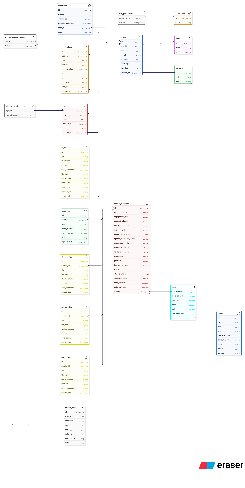
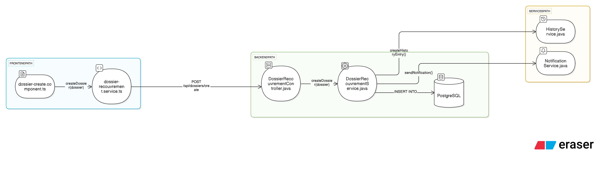

# Documentation Technique - Système de Gestion des Dossiers de Recouvrement BNM

## 📋 Table des Matières

1. [Vue d'ensemble du Projet](#vue-densemble-du-projet)
2. [Architecture du Projet](#architecture-du-projet)
3. [Technologies Utilisées](#technologies-utilisées)
4. [Modélisation de la Base de Données](#modélisation-de-la-base-de-données)
5. [Système de Sécurité](#système-de-sécurité)
6. [API REST](#api-rest)
7. [Frontend Angular](#frontend-angular)
8. [Gestion des Erreurs](#gestion-des-erreurs)
9. [Tests](#tests)
10. [Guide d'Exécution](#guide-dexécution)
11. [Erreurs Fréquentes](#erreurs-fréquentes)
12. [Annexes](#annexes)

---

## 🎯 Vue d'ensemble du Projet

### Objectif
Le projet de développement de l'application de gestion des dossiers de recouvrement a pour but principal de **moderniser et d'optimiser le processus de recouvrement des créances au sein de la BNM**.

### Fonctionnalités Principales
- ✅ Gestion complète des dossiers de recouvrement
- ✅ Système d'authentification et d'autorisation basé sur les rôles
- ✅ Upload et gestion de fichiers multiples (PDF, images)
- ✅ Workflow de validation multi-étapes
- ✅ Notifications automatiques par email
- ✅ Import/Export CSV
- ✅ Génération de rapports PDF
- ✅ Historique des actions utilisateurs
- ✅ Interface responsive et moderne

---

## 🏗️ Architecture du Projet

### Architecture Générale
```
┌─────────────────┐    HTTP/REST    ┌─────────────────┐    JPA/Hibernate    ┌─────────────────┐
│                 │    (Port 4200)  │                 │    (Port 5432)      │                 │
│  Frontend       │◄───────────────►│  Backend        │◄───────────────────►│  PostgreSQL     │
│  Angular 15     │    JWT Auth     │  Spring Boot    │                     │  Database       │
│                 │                 │  Java 17        │                     │                 │
└─────────────────┘                 └─────────────────┘                     └─────────────────┘
```

### Pattern Architectural

L'application suit une **architecture 3-tiers** avec une séparation claire entre :

- **Couche de présentation** : Frontend Angular
- **Couche métier** : Backend Spring Boot
- **Couche de données** : PostgreSQL

Le backend suit le modèle **MVC (Modèle-Vue-Contrôleur)**, tandis que le frontend Angular suit une **architecture orientée composants** qui s'apparente au modèle **MVVM (Model-View-ViewModel)** :

#### Architecture MVVM dans le Frontend Angular

- **Model** : Classes de modèles dans `src/app/shared/models`
- **View** : Templates HTML et CSS dans les composants
- **ViewModel** : Composants TypeScript et services qui font le lien entre la vue et le modèle

#### Architecture MVC dans le Backend Spring Boot

- **Modèle** : Entités JPA dans `com.bnm.recouvrement.entity`
- **Vue** : Représentations JSON via ResponseEntity
- **Contrôleur** : Classes contrôleurs REST dans `com.bnm.recouvrement.controller`

- **Architecture 3-tiers** : Présentation (Angular) → Logique Métier (Spring Boot) → Données (PostgreSQL)
- **Séparation des responsabilités** : Frontend/Backend découplés
- **API REST** : Communication stateless avec authentification JWT
- **Microservices-ready** : Structure modulaire permettant l'évolution vers des microservices

### Relations entre Modules

#### Backend → Database
- **ORM** : JPA/Hibernate pour la persistance
- **Migrations** : Flyway pour la gestion des versions de schéma
- **Connexion** : Pool de connexions configuré via Spring Boot

#### Structure du Backend

Le backend est organisé selon une structure claire et cohérente. Pour chaque fonctionnalité, on retrouve systématiquement :

- **Controller** : `com.bnm.recouvrement.controller` - Point d'entrée des requêtes HTTP
- **Service** : `com.bnm.recouvrement.service` - Logique métier
- **Entity** : `com.bnm.recouvrement.entity` - Modèles de données
- **Repository** : `com.bnm.recouvrement.dao` ou `com.bnm.recouvrement.repository` - Accès aux données

#### Dossiers spéciaux

- **Config/** : Configuration de l'application
  - `SecurityConfig.java` : Configuration de Spring Security et JWT
  - `CorsConfig.java` : Configuration CORS pour les requêtes cross-origin
  - `JacksonConfig.java` : Configuration de la sérialisation JSON
  - `JwtConfig.java` : Configuration des tokens JWT

- **utils/** : Classes utilitaires
  - `Constants.java` : Constantes utilisées dans l'application

- **loader/** : Chargement des données initiales
  - Contient les scripts pour initialiser la base de données avec les utilisateurs admin, les permissions, etc.

- **scheduler/** : Tâches planifiées
  - `GarantieReminderScheduler.java` : Scheduler pour les rappels de garanties (fonctionnalité obsolète à retravailler)

- **mapper/** : Mappers entre entités et DTOs
  - Dossier à supprimer car non utilisé dans la version actuelle

#### Frontend → Backend
- **Protocole** : HTTP/HTTPS avec API REST
- **Authentification** : JWT Bearer Token
- **Format** : JSON pour les échanges de données
- **CORS** : Configuration pour autoriser localhost:4200

#### Protocoles de Communication
- **HTTP Methods** : GET, POST, PUT, DELETE, OPTIONS
- **Content-Type** : application/json, multipart/form-data (upload)
- **Headers** : Authorization (Bearer token), Content-Type

---

## 🛠️ Technologies Utilisées

### Backend (Spring Boot 3.3.5)
| Technologie | Version | Usage |
|-------------|---------|-------|
| **Java** | 17 | Langage principal |
| **Spring Boot** | 3.3.5 | Framework principal |
| **Spring Security** | 6.x | Authentification/Autorisation |
| **Spring Data JPA** | 3.x | Persistance des données |
| **PostgreSQL** | Latest | Base de données |
| **JWT (jjwt)** | 0.11.5 | Gestion des tokens |
| **Apache PDFBox** | 2.0.27 | Génération PDF |
| **iTextPDF** | 5.5.13.3 | Manipulation PDF |
| **OpenCSV** | 2.3 | Import/Export CSV |
| **Spring Mail** | 3.x | Envoi d'emails |
| **Lombok** | Latest | Réduction du code boilerplate |

### Frontend (Angular 15.2.0)
| Technologie | Version | Usage |
|-------------|---------|-------|
| **Angular** | 15.2.0 | Framework frontend |
| **TypeScript** | 4.9.0 | Langage de développement |
| **Angular Material** | 15.2.9 | Composants UI |
| **RxJS** | 7.8.0 | Programmation réactive |
| **FontAwesome** | 6.7.1 | Icônes |
| **jsPDF** | 3.0.1 | Génération PDF côté client |
| **html2pdf.js** | 0.10.3 | Conversion HTML vers PDF |
| **ng2-pdf-viewer** | 10.4.0 | Visualisation PDF |

### Base de Données
- **PostgreSQL** : Base de données principale
- **Host** : localhost:5432
- **Database** : testman
- **Credentials** : postgres/12345678

---

## 🗄️ Modélisation de la Base de Données

### Diagramme ERD - Code pour app.eraser.com



### Statuts et Énumérations

#### Status du Dossier
```java
public enum Status {
    EN_COURS, ARCHIVEE, CLIENT_RELANCE, PROTOCOLE_SIGNE,
    RECOUVREMENT_AMIABLE, EN_JUSTICE, JUGEMENT_RENDU,
    ADJUDICATION_EN_COURS, CLOTURE, ARCHIVE, REJETE
}
```

#### État de Validation
```java
public enum EtatValidation {
    INITIALE, COMPLET, VALIDE, NON_VALIDE
}
```

---

## 🔐 Système de Sécurité

### Configuration de la Sécurité

La sécurité est gérée principalement par les fichiers dans le dossier `Config/` du backend :

- **SecurityConfig.java** : Configuration principale de Spring Security
  - Définit les règles d'accès aux endpoints REST
  - Configure l'authentification stateless avec JWT
  - Désactive CSRF et active CORS

- **JwtConfig.java** : Configuration des tokens JWT
  - Définit la clé secrète et l'algorithme de signature (HS256)
  - Configure la durée de validité des tokens (10 heures)

- **CorsConfig.java** : Configuration CORS
  - Autorise les requêtes depuis l'origine du frontend (localhost:4200)
  - Configure les méthodes HTTP autorisées et les headers

### Méthodes d'Authentification

#### 1. JWT (JSON Web Token)
- **Algorithme** : HS256 (HMAC SHA-256)
- **Secret Key** : `pFR/4gKqQWIdGIO+dE37DCthVlCbcI1bGtprGDW18+M=`
- **Expiration** : 10 heures (36000 secondes)
- **Claims inclus** :
  - `userId` : ID de l'utilisateur
  - `role` : Nom du rôle
  - `permissions` : Liste des permissions
  - `userType` : Type d'utilisateur

#### 2. Configuration Spring Security
```java
@Configuration
@EnableWebSecurity
@EnableMethodSecurity
public class SecurityConfig {
    
    @Bean
    public SecurityFilterChain securityFilterChain(HttpSecurity http) {
        return http
            .csrf(csrf -> csrf.disable())
            .cors(cors -> cors.configurationSource(corsConfigurationSource()))
            .authorizeHttpRequests(auth -> auth
                .requestMatchers("/auth/**").permitAll()
                .requestMatchers("/clients/**").hasAuthority("READ_CLIENT")
                .anyRequest().authenticated()
            )
            .sessionManagement(session -> session
                .sessionCreationPolicy(SessionCreationPolicy.STATELESS)
            )
            .addFilterBefore(jwtFilter, UsernamePasswordAuthenticationFilter.class)
            .build();
    }
}
```

### Système de Permissions

#### Permissions par Entité
```java
// CLIENTS
READ_CLIENT, CREATE_CLIENT, UPDATE_CLIENT, DELETE_CLIENT, IMPORT_CLIENT

// COMPTES  
READ_COMPTE, CREATE_COMPTE, UPDATE_COMPTE, DELETE_COMPTE

// CREDITS
READ_CREDIT, CREATE_CREDIT, UPDATE_CREDIT, DELETE_CREDIT

// DOSSIERS
READ_DOSSIER, CREATE_DOSSIER, UPDATE_DOSSIER, DELETE_DOSSIER

// FICHIERS
UPLOAD_CHEQUE_FILE, DOWNLOAD_CHEQUE_FILE, DELETE_CHEQUE_FILE
UPLOAD_CAUTION_FILE, DOWNLOAD_CAUTION_FILE, DELETE_CAUTION_FILE
UPLOAD_CREDIT_FILE, DOWNLOAD_CREDIT_FILE, DELETE_CREDIT_FILE
UPLOAD_LC_FILE, DOWNLOAD_LC_FILE, DELETE_LC_FILE

// ADMIN
CREATE_ROLE, READ_ROLE, UPDATE_ROLE, DELETE_ROLE
CREATE_USER, READ_USER, UPDATE_USER, DELETE_USER
```

### Politique de Sécurité

#### CORS (Cross-Origin Resource Sharing)
```java
@Bean
public CorsConfigurationSource corsConfigurationSource() {
    CorsConfiguration configuration = new CorsConfiguration();
    configuration.setAllowedOrigins(List.of("http://localhost:4200"));
    configuration.setAllowedMethods(List.of("GET", "POST", "PUT", "DELETE", "OPTIONS"));
    configuration.setAllowedHeaders(List.of("*"));
    configuration.setAllowCredentials(true);
    configuration.setExposedHeaders(List.of("Authorization"));
    return source -> configuration;
}
```

#### Protection CSRF
- **Désactivé** pour les API REST (stateless)
- **Justification** : Utilisation de JWT au lieu de cookies de session

#### Protection XSS
- **Validation** : Validation des entrées côté backend
- **Échappement** : Échappement automatique des données dans les templates Angular
- **Headers** : Content-Type strict

---

## 🌐 API REST

### Documentation complète des endpoints

#### 1. Authentification (`/auth`)
| Méthode | Endpoint | Description | Paramètres | Permissions |
|---------|----------|-------------|-----------|------------|
| POST | `/auth/login` | Connexion utilisateur | `email`, `password` | Public |
| POST | `/auth/register` | Inscription utilisateur | `email`, `name`, `password`, `roleId` | Public |
| POST | `/auth/change-password` | Changement de mot de passe | `oldPassword`, `newPassword` | Authentifié |

#### 2. Dossiers de Recouvrement (`/dossiers`)
| Méthode | Endpoint | Description | Paramètres | Permissions |
|---------|----------|-------------|-----------|------------|
| GET | `/dossiers/affichage` | Liste des dossiers | - | READ_DOSSIER |
| GET | `/dossiers/{id}` | Détails d'un dossier | `id` | READ_DOSSIER |
| POST | `/dossiers/create` | Création d'un dossier | Objet dossier | CREATE_DOSSIER |
| PUT | `/dossiers/update/{id}` | Modification d'un dossier | `id`, Objet dossier | UPDATE_DOSSIER |
| DELETE | `/dossiers/delete/{id}` | Suppression d'un dossier | `id` | DELETE_DOSSIER |
| GET | `/dossiers/search` | Recherche de dossiers | `dossierId`, `numeroCompte`, `nomClient` | READ_DOSSIER |
| POST | `/dossiers/{id}/fusionner-complet` | Fusion PDF complète | `id`, `detailsPdf`, `miseEnDemeurePdf` | READ_DOSSIER |
| POST | `/dossiers/import` | Import de dossiers via CSV | `file` (CSV) | CREATE_DOSSIER |
| POST | `/dossiers/{id}/archiver` | Archivage d'un dossier | `id` | UPDATE_DOSSIER |
| POST | `/dossiers/{id}/desarchiver` | Désarchivage d'un dossier | `id` | UPDATE_DOSSIER |
| POST | `/dossiers/{id}/reset-validation` | Réinitialisation validation | `id` | UPDATE_DOSSIER |
| GET | `/dossiers/actifs` | Liste des dossiers actifs | - | READ_DOSSIER |
| GET | `/dossiers/archives` | Liste des dossiers archivés | - | READ_DOSSIER |
| GET | `/dossiers/count-archives` | Comptage des dossiers archivés | - | READ_DOSSIER |
| GET | `/dossiers/{id}/is-archived` | Vérification si archivé | `id` | READ_DOSSIER |
| GET | `/dossiers/{id}/check-files` | Vérification des fichiers | `id` | READ_DOSSIER |

#### 3. Clients (`/clients`)
| Méthode | Endpoint | Description | Paramètres | Permissions |
|---------|----------|-------------|-----------|------------|
| GET | `/clients/Affichage` | Liste des clients | - | READ_CLIENT |
| GET | `/clients/{nni}` | Détails d'un client | `nni` | READ_CLIENT |
| POST | `/clients/create` | Création d'un client | Objet client | CREATE_CLIENT |
| POST | `/clients/import-client` | Import CSV | `file` (CSV) | IMPORT_CLIENT |
| PUT | `/clients/update/{id}` | Modification d'un client | `id`, Objet client | UPDATE_CLIENT |
| DELETE | `/clients/delete/{id}` | Suppression d'un client | `id` | DELETE_CLIENT |

#### 4. Utilisateurs (`/users`)
| Méthode | Endpoint | Description | Paramètres | Permissions |
|---------|----------|-------------|-----------|------------|
| GET | `/users` | Liste de tous les utilisateurs | - | READ_USER |
| POST | `/users` | Création d'un utilisateur | Objet user | CREATE_USER |
| GET | `/users/type/{userType}` | Utilisateurs par type | `userType` | READ_USER |
| GET | `/users/types` | Utilisateurs par types multiples | `types` (séparés par virgule) | READ_USER |

#### 5. Administration (`/admin`)
| Méthode | Endpoint | Description | Paramètres | Permissions |
|---------|----------|-------------|-----------|------------|
| GET | `/admin/roles` | Liste des rôles | - | READ_ROLE |
| POST | `/admin/roles` | Création d'un rôle | Objet role | CREATE_ROLE |
| PUT | `/admin/roles/{id}` | Modification d'un rôle | `id`, Objet role | UPDATE_ROLE |
| DELETE | `/admin/roles/{id}` | Suppression d'un rôle | `id` | DELETE_ROLE |
| GET | `/admin/users` | Liste des utilisateurs | - | READ_USER |
| POST | `/admin/users` | Création d'un utilisateur | Objet user | CREATE_USER |
| PUT | `/admin/users/{id}` | Modification d'un utilisateur | `id`, Objet user | UPDATE_USER |
| DELETE | `/admin/users/{id}` | Suppression d'un utilisateur | `id` | DELETE_USER |

#### 6. Comptes (`/comptes`)
| Méthode | Endpoint | Description | Paramètres | Permissions |
|---------|----------|-------------|-----------|------------|
| GET | `/comptes/affichage` | Liste des comptes | - | READ_COMPTE |
| GET | `/comptes/{id}` | Détails d'un compte | `id` | READ_COMPTE |
| POST | `/comptes/create` | Création d'un compte | Objet compte | CREATE_COMPTE |
| PUT | `/comptes/update/{id}` | Modification d'un compte | `id`, Objet compte | UPDATE_COMPTE |
| DELETE | `/comptes/delete/{id}` | Suppression d'un compte | `id` | DELETE_COMPTE |
| POST | `/comptes/import` | Import CSV | `file` (CSV) | IMPORT_COMPTE |

#### 7. Fichiers

##### 7.1 Chèques (`/cheques`)
| Méthode | Endpoint | Description | Paramètres | Permissions |
|---------|----------|-------------|-----------|------------|
| POST | `/cheques/upload/{dossierId}` | Upload fichier chèque | `dossierId`, `file` | UPLOAD_CHEQUE_FILE |
| GET | `/cheques/download/{dossierId}` | Téléchargement fichier | `dossierId` | DOWNLOAD_CHEQUE_FILE |
| DELETE | `/cheques/delete/{dossierId}` | Suppression fichier | `dossierId` | DELETE_CHEQUE_FILE |

##### 7.2 Cautions (`/cautions`)
| Méthode | Endpoint | Description | Paramètres | Permissions |
|---------|----------|-------------|-----------|------------|
| POST | `/cautions/upload/{dossierId}` | Upload fichier caution | `dossierId`, `file` | UPLOAD_CAUTION_FILE |
| GET | `/cautions/download/{dossierId}` | Téléchargement fichier | `dossierId` | DOWNLOAD_CAUTION_FILE |
| DELETE | `/cautions/delete/{dossierId}` | Suppression fichier | `dossierId` | DELETE_CAUTION_FILE |

##### 7.3 Crédits (`/credits`)
| Méthode | Endpoint | Description | Paramètres | Permissions |
|---------|----------|-------------|-----------|------------|
| POST | `/credits/upload/{dossierId}` | Upload fichier crédit | `dossierId`, `file` | UPLOAD_CREDIT_FILE |
| GET | `/credits/download/{dossierId}` | Téléchargement fichier | `dossierId` | DOWNLOAD_CREDIT_FILE |
| DELETE | `/credits/delete/{dossierId}` | Suppression fichier | `dossierId` | DELETE_CREDIT_FILE |

##### 7.4 Lettres de crédit (`/lc-files`)
| Méthode | Endpoint | Description | Paramètres | Permissions |
|---------|----------|-------------|-----------|------------|
| POST | `/lc-files/upload/{dossierId}` | Upload fichier LC | `dossierId`, `file` | UPLOAD_LC_FILE |
| GET | `/lc-files/download/{dossierId}` | Téléchargement fichier | `dossierId` | DOWNLOAD_LC_FILE |
| DELETE | `/lc-files/delete/{dossierId}` | Suppression fichier | `dossierId` | DELETE_LC_FILE |

#### 8. Commentaires (`/comments`)
| Méthode | Endpoint | Description | Paramètres | Permissions |
|---------|----------|-------------|-----------|------------|
| GET | `/comments/dossier/{dossierId}` | Commentaires d'un dossier | `dossierId` | READ_DOSSIER |
| POST | `/comments/add` | Ajout d'un commentaire | Objet comment | Authentifié |
| DELETE | `/comments/{id}` | Suppression commentaire | `id` | Auteur ou ADMIN |

#### 9. Notifications (`/notifications`)
| Méthode | Endpoint | Description | Paramètres | Permissions |
|---------|----------|-------------|-----------|------------|
| GET | `/notifications/user` | Notifications utilisateur | - | Authentifié |
| POST | `/notifications/mark-read/{id}` | Marquer comme lue | `id` | Authentifié |
| POST | `/notifications/mark-all-read` | Tout marquer comme lu | - | Authentifié |

#### 10. Rejets (`/rejets`)
| Méthode | Endpoint | Description | Paramètres | Permissions |
|---------|----------|-------------|-----------|------------|
| POST | `/rejets/create` | Création d'un rejet | Objet rejet | UPDATE_DOSSIER |
| GET | `/rejets/dossier/{dossierId}` | Rejets d'un dossier | `dossierId` | READ_DOSSIER |

#### 11. Dashboard (`/dashboard`)
| Méthode | Endpoint | Description | Paramètres | Permissions |
|---------|----------|-------------|-----------|------------|
| GET | `/dashboard/stats` | Statistiques globales | - | Authentifié |
| GET | `/dashboard/dossiers-by-status` | Dossiers par statut | - | Authentifié |
| GET | `/dashboard/recent-activity` | Activité récente | - | Authentifié |

#### 12. Historique (`/history`)
| Méthode | Endpoint | Description | Paramètres | Permissions |
|---------|----------|-------------|-----------|------------|
| GET | `/history/dossier/{dossierId}` | Historique d'un dossier | `dossierId` | READ_DOSSIER |
| GET | `/history/user/{userId}` | Historique d'un utilisateur | `userId` | READ_USER |
| GET | `/history/recent` | Actions récentes | - | ROLE_ADMIN |

---

## 💻 Frontend Angular

{{ ... }}
### Structure du Frontend

Le frontend est organisé de façon modulaire. Pour chaque fonctionnalité, on retrouve systématiquement :

- **Component** : `src/app/pages/[fonctionnalité]/` - Interface utilisateur
- **Model** : `src/app/shared/models/` - Structures de données
- **Service** : `src/app/shared/services/` - Communication avec le backend
- **Route** : Définie dans `src/app/app-routing.module.ts`

#### Exemple : Gestion des dossiers de recouvrement

- **Component** : `src/app/pages/dossiers/dossier-recouvrement-add/dossier-recouvrement-add.component.ts`
- **Model** : `src/app/shared/models/dossier-recouvrement.model.ts`
- **Service** : `src/app/shared/services/dossier-recouvrement.service.ts`
- **Route** : Définie dans `src/app/app-routing.module.ts`




#### Modules principaux

- **app/** : Module racine avec routing et configuration
- **auth/** : Authentification (login, change-password)
- **admin/** : Administration (users, roles, agences, history)
- **pages/** : Pages métier (dashboard, dossiers, clients, comptes, etc.)
- **shared/** : Services partagés, guards, interceptors
- **components/** : Composants réutilisables (navbar, sidebar)
- **layouts/** : Layouts (auth-layout, main-layout)

### Services Principaux

#### AuthService
```typescript
@Injectable({ providedIn: 'root' })
export class AuthService {
  private readonly apiUrl = `${environment.apiUrl}/auth`;
  
  login(credentials: LoginRequest): Observable<AuthResponse> {
    return this.http.post<AuthResponse>(`${this.apiUrl}/login`, credentials);
  }
  
  hasPermission(permission: string): boolean {
    const token = localStorage.getItem('token');
    if (!token) return false;
    const decoded = jwt_decode(token) as any;
    return decoded.permissions?.includes(permission) || false;
  }
}
```

### Guards de Sécurité

- **AuthGuard** : Vérification authentification
- **RoleGuard** : Vérification des rôles
- **NonAdminGuard** : Accès non-admin
- **FirstLoginGuard** : Changement mot de passe obligatoire

---

## ⚠️ Gestion des Erreurs

### Backend
- **GlobalExceptionHandler** : Gestion centralisée des exceptions
- **Validation** : Bean Validation avec messages personnalisés
- **Logging** : SLF4J pour traçabilité

### Frontend
- **HttpErrorInterceptor** : Interception des erreurs HTTP
- **ErrorHandlingService** : Service centralisé de gestion d'erreurs
- **User Feedback** : Messages d'erreur utilisateur-friendly

---

## 🧪 Tests

### Types de Tests Mis en Place

#### Tests Unitaires
- **Backend** : JUnit 5 + Mockito
- **Frontend** : Jasmine + Karma
- **Couverture** : Services et composants critiques

#### Tests d'Intégration
- **API Tests** : TestContainers avec PostgreSQL
- **End-to-End** : Cypress (à implémenter)

---

## 🚀 Guide d'Exécution

### Prérequis
- **Java 17+**
- **Node.js 16+**
- **PostgreSQL 12+**
- **Maven 3.6+**
- **Angular CLI 15+**

### Exécution Locale

#### 1. Base de Données
```bash
# Créer la base de données
createdb testman
```

#### 2. Backend
```bash
cd dossiers-recouvrement-backend
mvn spring-boot:run
# Serveur disponible sur http://localhost:8080
```

#### 3. Frontend
```bash
cd dossier_recouvrement_frontend
npm install
ng serve
# Application disponible sur http://localhost:4200
```

### Exécution avec Docker

#### 1. Créer un dossier de projet
```bash
mkdir project
cd project
```

#### 2. Cloner le dépôt frontend (branche prod)
```bash
git clone -b prod https://github.com/AhmedouBouk/dossier_recouvrement_frontend.git
```

#### 3. Cloner le dépôt backend (branche prod)
```bash
git clone -b prod https://github.com/AhmedouBouk/dossiers-recouvrement-backend.git
```

#### 4. Naviguer vers le dossier backend
```bash
cd dossiers-recouvrement-backend
```

#### 5. Construire et démarrer l'application avec Docker
```bash
docker compose up --build
```

### 🌐 Accès à l'Application
Une fois que tout est lancé, vous pouvez tester l'application en visitant :

http://localhost

### 🔐 Identifiants Admin par Défaut

- Nom d'utilisateur : admin@bnm.mr
- Mot de passe : 123456


---

## 🔧 Erreurs Fréquentes

### 1. Erreur 403 Forbidden
**Cause** : Permissions insuffisantes ou token expiré
**Solution** :
- Vérifier les permissions utilisateur
- Renouveler le token JWT
- Vérifier la configuration CORS

### 2. Erreur Upload de Fichiers
**Cause** : Taille de fichier dépassée (limite 2MB)
**Solution** :
- Réduire la taille du fichier
- Modifier `spring.servlet.multipart.max-file-size`

### 3. Erreur de Connexion Base de Données
**Cause** : PostgreSQL non démarré ou mauvaises credentials
**Solution** :
- Vérifier le service PostgreSQL
- Contrôler `application.properties`

### 4. Erreur CORS
**Cause** : Frontend sur un port différent de 4200
**Solution** :
- Modifier `SecurityConfig.java`
- Ajouter le nouveau port dans `allowedOrigins`

---

## 📚 Annexes

### Fichiers de Test et Documentation

Le dossier `Documentation-Recouvrement` contient plusieurs fichiers utiles :

#### Fichiers CSV pour les tests

- `clients (1).csv` : Données clients pour tester l'import CSV
- `comptes (1).csv` : Données comptes pour tester l'import CSV
- `DossiersClients (1).csv` : Données dossiers-clients pour tester l'import CSV

Ces fichiers peuvent être importés dans l'application pour tester les fonctionnalités d'import.

#### Documents de référence

- `Cahier des Charges - Application de Gestion des Dossiers de Recouvrement.docx (2).pdf` : Cahier des charges détaillé
- `TDR application de gestion dossiers de recouvrement.pdf` : Termes de référence du projet
- `diagramme-BD.png` : Diagramme de la base de données
- `dossier-create.png` : Diagramme de flux pour la création d'un dossier

### Références Techniques
- [Spring Boot Documentation](https://spring.io/projects/spring-boot)
- [Angular Documentation](https://angular.io/docs)
- [JWT.io](https://jwt.io/)
- [PostgreSQL Documentation](https://www.postgresql.org/docs/)

### Contacts Équipe
- **Développeur Principal** : Mohamedou Bouk - 23083@esp.mr
- **Développeur** : Mariem Ejiwene - 23018@esp.mr
- **Développeur** : Babah  - 23064@esp.mr
- **Développeur** : selma - 23042@esp.mr

### Versions et Changelog
- **v1.0.0** : Version initiale avec fonctionnalités de base
- **v1.1.0** : Ajout gestion multi-fichiers
- **v1.2.0** : Workflow de validation amélioré

---

**Dernière mise à jour** : 29 Juillet 2025
**Version de la documentation** : 1.0.0
